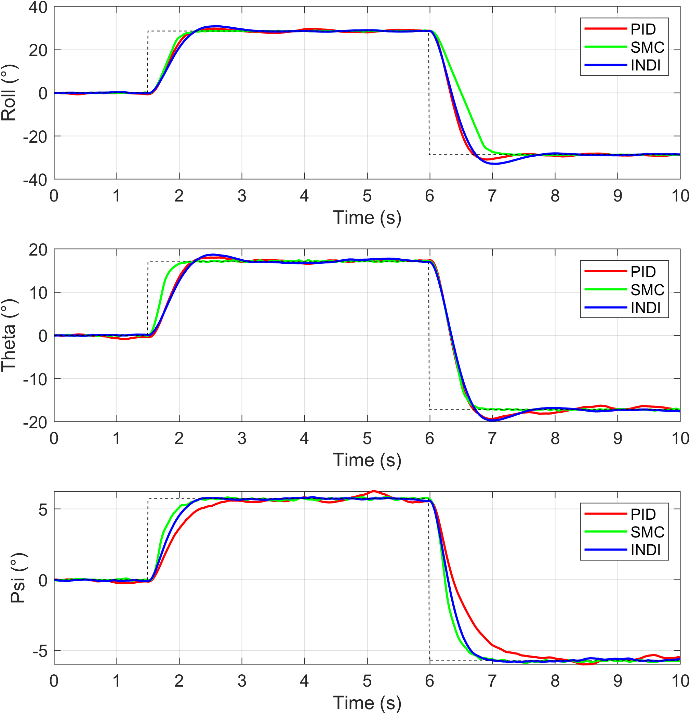

# Quadcopter Drone Simulation

This repository contains a MATLAB simulation of a quadcopter with three control strategies: PID, Sliding Mode Control (SMC), and Incremental Nonlinear Dynamic Inversion (INDI).

## Features
- **Nonlinear quadcopter dynamics** 
- **Motor dynamics (1st order)**
- **Sensor noise**
- **Wind disturbances**
- **Switchable controller**: Choice of PID, SMC, or INDI (set `controller_type` at the top of the script)

## How to Run
1. Open `main.m` in MATLAB.
2. Set the controller type at the top of the script:
   - `controller_type = 0` for PID
   - `controller_type = 1` for SMC
   - `controller_type = 2` for INDI
3. Run the script. Plots will be generated at the end of the simulation.

## Dynamics Overview
The quadcopter is modeled with the following states:
- **z**: altitude
- **phi, theta, psi**: roll, pitch, yaw angles
- **p, q, r**: angular rates (roll, pitch, yaw)

### Translational Dynamics
The vertical (z) acceleration is computed as:
```
az = (sum of rotor thrusts) / mass - gravity
```

### Rotational Dynamics
The torques about each axis are computed from the differences in rotor thrusts, arm length, and yaw drag coefficient. Angular accelerations are then:
```
dp = tau_phi / Ixx
```
(similar for dq, dr)

### Motor Dynamics
Each motor's thrust is modeled as a first-order lag:
```
T_dot = (T_command - T_actual) / tau_motor
```
This simulates the delay between commanded and actual thrust.

### Sensor Noise
Sensor measurements for altitude, velocity, angles, and angular rates are corrupted with Gaussian noise to simulate real-world sensor imperfections.

<div align="center">
  
</div>  
